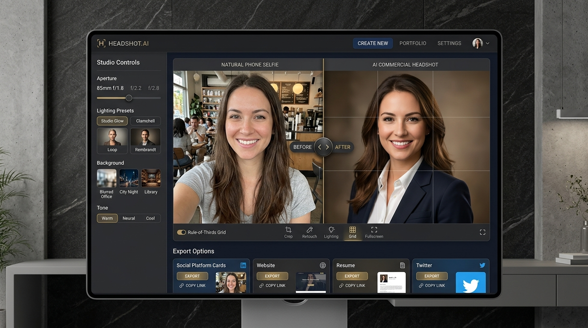

# AI Commercial Portrait & Headshot Photographer Studio



Transform casual smartphone selfies and snapshots into studio-grade executive commercial portraits with authentic 85mm prime lens depth-of-field, tailored lighting schemes, professional wardrobe stylings, and darkroom post-processing.

---

## ✨ Features & Highlights

- **⚡ Studio Photography Engine (Gemini & Imagen 3)**
  - Seamless generation of photorealistic headshots preserving natural facial features, eye reflections (catchlights), skin texture, and realistic hair rendering.
  - Multi-style studio backdrops: **Corporate Slate Grey**, **Modern Tech Office Bokeh**, **Outdoor Natural Light**, **Executive Editorial**, and **Creative Monochrome**.
  - Natural wardrobe conversions: Charcoal suits, crisp oxford collars, modern blazers, and minimalist tech mock-necks.

- **🎛️ Interactive Before / After Split Slider**
  - Instant side-by-side and interactive split-screen comparison slider between the uploaded casual selfie and the studio headshot.
  - Quick zoom, side-by-side preview, and avatar circular preview mode.

- **🎨 Darkroom Color Grading & Optical Adjustments**
  - **Aperture & Bokeh Depth of Field**: Real-time adjustable background blur simulating $f/1.2$, $f/1.4$, $f/1.8$, $f/2.8$, and $f/4.0$ prime lens physics.
  - **Exposure & Contrast Calibration**: Precision lighting adjustments with 1-click studio filter presets (Clean Corporate, Warm Executive, Cinematic Editorial, Noir Monochromatic).
  - **AI Skin Smoothing & Micro-Contrast**: Subtle, natural blemish softening with unsharp-mask edge sharpening.

- **✂️ Studio Cropping & Rule-of-Thirds Viewfinder**
  - Interactive camera viewfinder with corner bracket reticles and toggleable 3×3 composition grid with eye-level alignment markers.
  - Standard aspect ratio framing: **1:1 Square** (Avatar / Social), **3:4 Portrait** (Resume / Bio), **4:5 Portrait** (Instagram / Editorial), **16:9 Landscape** (Keynote / Banner), and **3:2 Classic** (35mm Film).
  - Smooth drag-to-pan repositioning and directional nudge controls.

- **🚀 Multi-Platform Social Export & Share Hub**
  - **1-Click Social Sharing**: Instant pre-formatted post composer for **LinkedIn**, **Facebook**, **X (Twitter)**, **Threads**, and **Instagram**.
  - **Dedicated Facebook Integration**: Direct Facebook sharer dialog, auto-formatted update announcements, and headshot preview link generation.
  - **Platform-Optimized Downloads**: Master PNG, LinkedIn Avatar (400×400), Twitter Profile (400×400), Instagram Portrait (1080×1350), and 300 DPI Print formats.

- **📸 In-App Live Webcam Capture**
  - Integrated browser camera capture with live oval alignment guide, lighting condition warnings, and timer countdown.

---

## 🛠️ Technology Stack

| Layer | Technologies |
|---|---|
| **Frontend** | React 19, TypeScript, Tailwind CSS v4, Motion, Lucide Icons |
| **Backend** | Express 4, Node.js (ESM / tsx), `@google/genai` TypeScript SDK |
| **AI / Vision** | Google Gemini 2.5 Flash / Imagen 3 Vision API |
| **Image Processing** | HTML5 Canvas 2D Pipeline with Optical Convolution & Mask Gradients |
| **Build & Tooling** | Vite 6, esbuild, TypeScript Compiler (`tsc`) |

---

## 🚀 Getting Started

### Prerequisites

- [Node.js](https://nodejs.org/) (version 18+ or 20+ LTS recommended)
- [npm](https://www.npmjs.com/) or [bun](https://bun.sh/)
- A [Google AI Studio Gemini API Key](https://aistudio.google.com/)

### 1. Clone the Repository

```bash
git clone https://github.com/your-username/ai-headshot-photographer.git
cd ai-headshot-photographer
```

### 2. Install Dependencies

```bash
npm install
```

### 3. Configure Environment Variables

Create a `.env` file in the root directory (based on `.env.example`):

```bash
cp .env.example .env
```

Add your Gemini API Key:

```env
GEMINI_API_KEY=your_google_gemini_api_key_here
```

### 4. Run Development Server

```bash
npm run dev
```

The application will be running locally at `http://localhost:3000`.

---

## 📦 Build & Production

To create an optimized production bundle:

```bash
npm run build
```

To run the production server:

```bash
npm start
```

---

## 📁 Project Structure

```
├── assets/                  # Public and static assets
├── src/
│   ├── assets/              # Generated UI preview graphics & icons
│   ├── components/
│   │   ├── CameraAlignmentGuide.tsx # Live camera face guide overlay
│   │   ├── GenerationProgress.tsx   # AI generation step indicators
│   │   ├── Header.tsx               # Studio top navigation header
│   │   ├── HeadshotGallery.tsx      # Saved headshots history
│   │   ├── HeadshotViewer.tsx       # Darkroom studio inspector & viewer
│   │   ├── SelfieUploader.tsx       # Drag-and-drop selfie upload dropzone
│   │   ├── ShareModal.tsx           # Social post composer (LinkedIn, Facebook, X)
│   │   ├── StudioControls.tsx       # Backdrop, lighting, and wardrobe pickers
│   │   ├── StyleSelector.tsx        # Preset gallery selection cards
│   │   └── WebcamModal.tsx          # Camera streaming & countdown capture
│   ├── data/
│   │   ├── filters.ts               # Darkroom color grading presets
│   │   ├── platformPresets.ts       # Social aspect ratio and dimension definitions
│   │   └── sampleHeadshots.ts       # Built-in demo headshots & metadata
│   ├── utils/
│   │   ├── geminiHeadshot.ts        # Client-to-server headshot generation client
│   │   └── portraitCanvas.ts        # 2D Canvas rendering & export engine
│   ├── App.tsx                      # Main Studio application orchestration
│   ├── main.tsx                     # React client bootstrap
│   ├── index.css                    # Tailwind CSS configuration
│   └── types.ts                     # Global TypeScript interfaces
├── metadata.json            # Application capabilities and permissions
├── server.ts                # Express backend proxy for Gemini API calls
├── vite.config.ts           # Vite build and plugin configuration
└── README.md                # Project documentation
```

---

## 🔒 Privacy & API Security

- All API communications with the Google Gemini SDK are handled **server-side** via Express endpoints (`/api/*`), ensuring your `GEMINI_API_KEY` is never exposed to the client browser.
- Uploaded selfies and generated headshots are stored safely in browser local state and memory during your active session.

---

## 📄 License

This project is open source and available under the [MIT License](LICENSE).
